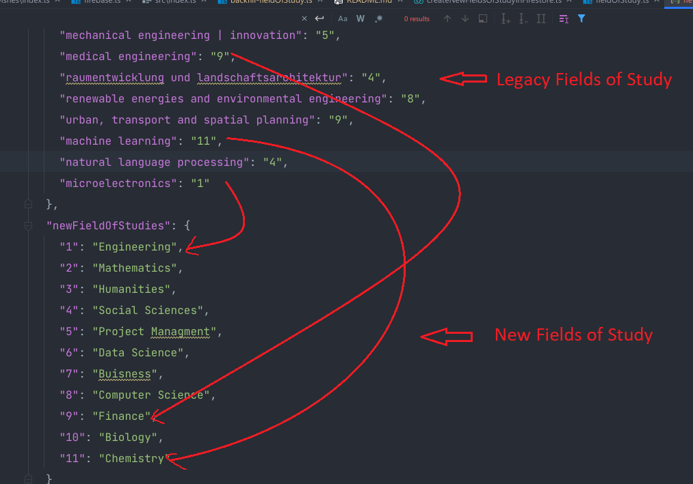

# CareerFairy Apps

Monorepo with all the apps, managed by npm workspaces and turborepo.

### Requirements

-  `node` v14 (webapp), v16 (functions)
-  `npm` (>v7)

## Setup root folder

Since we're using npm workspaces, only run `npm` commands on the root folder. There will be a shared `node_modules`
folder at the root folder for all the apps/packages.

```sh
# install deps for all workspaces (app/*, packages/*)
npm install

# runs only once after cloning, will setup husky hooks
npm prepare
```

## NPM Commands

```sh
# Builds all the workspaces
npm run build

# Fetches a remote production backup and stores on emulatorData/fetched
npm run start -w @careerfairy/fetch-firestore-data

# Dev environment with hot reload
# web app + local emulators with data imported from emulatorData/fetched
# Since this runs the firebase emulators, you need 10GB of memory available, check (/packages/fetch-firestore-data/README.md)
npm run dev

# Installing a dependency, you need to specify the workspace
npm install --workspace @careerfairy/webapp lodash
```

## Existing Git Hooks

-  Pre-commit: will run prettier formater
-  Pre-push: will run unit tests

# Web App (NextJS)

## Development

```sh
npm run dev -w @careerfairy/webapp
```

## Testing

There are two types of tests that you can run

-  Unit Tests with Jest:

```sh
npm run test
# To run all normal unit test files located in apps/packages that have them
```

-  End-To-End Tests with Playwright:

```sh
npm run test:e2e-webapp
# Run the end-to-end tests for the web app
# using the functions, firestore and auth emulators
```

The upon test completion or failure a report html folder is generated which can be accessed
in `./apps/web/playwright-report`. If the test had failed, the report will include screenshots and video recordings of
what produced the failure as seen below:


There are two ways in which you can open up the report:

-  running the root script `npm run webapp:report`
-  Running the index.html file within `./apps/web/playwright-report`

## CI

The CI Pipeline now runs on every push/pull_request test results are always uploaded through a GitHub action and are
stored in a zip file attached to the pipeline as seen below:


# Firebase Functions

## Build

```sh
npm run build -w @careerfairy/functions
# or npm run build
```

## Deploy a function

```sh
cd packages/functions
npx firelink deploy --only functions:slackHandleInteractions
```

## Start the firebase emulators with data

Run the script `packages/fetch-firestore-data` (check its readme for more info):

```sh
# Fetches a remote production backup and stores on emulatorData/fetched
npm run start -w @careerfairy/fetch-firestore-data
```

### Emulator UI

When running `npm run dev` or `npm run dev -w @careerfairy-functions` the emulators will be started.

http://localhost:4000/

## Firestore Rules

Update the `firestore.rules` file with your new rules, test them using the local emulators.

Create a Pull Request with the new changes, and only after approval, you should deploy them using `npm run deploy:rules`
.

### Run E2E tests on a linux docker container

Useful to find test flaws that appear during CI.

```sh
docker build -t tests -f apps/web/Dockerfile.test . && docker run -p 9323:9323 -it tests
```

### Emulator Functions - Sending Emails

There are functions that try to send emails, but when running the emulators locally, both Postmark and Mailgun providers
are setup to use their sandbox environments.

-  Mailgun: Emails are only sent to whitelisted addresses on their sandbox environment.
-  Postmark: You need to check the outbound emails on their sandbox environment dashboard.

# Firebase Scripts

## Run the script

This will execute the script using the firestore emulator db.

```sh
npm run script -w @careerfairy/firebase-scripts -- scriptPath=<path-to-script>
```

In order to run the script on production you need to add a flag `useProd=true` to the command.

```sh
npm run script -w @careerfairy/firebase-scripts -- useProd=true scriptPath=<path-to-script>
```

## Migrations

## `createNewFieldsOfStudyInFirestore`

This script will create/replace the `fieldOfStudy`
collection based on the JSON file
in `packages/firebase-scripts/data/fieldOfStudyMapping.json`([how to generate this file](#Save Field Of Study Mappings To Json))
. It will look at the `newFieldOfStudies`
property in the JSON file and create/replace the collection. The key will be the document id and the value will be the
label field value in the document data.

Example:


To run the script:

```sh
npm run script -w @careerfairy/firebase-scripts -- scriptPath=./migrations/createNewFieldsOfStudyInFirestore
```

## `backfill-fieldOfStudy`

This script will go through every user in the userData collection and try to figure their legacy field of study based on
their group registration data. If a legacy field of study is found it will look at the JSON file
in `packages/firebase-scripts/data/fieldOfStudyMapping.json`([how to generate this file](#Save Field Of Study Mappings To Json))
and map the legacy field of study to the new field of studies and add the corresponding ID to the fieldOfStudy field on
the user data document.

Example:

In the example bellow, lets say the user has a legacy field of study of `microelectronics`
in the JSON file we can see that the mapping ID for `microelectronics` is 1 which is the key for `Engineering` in
the `newFieldOfStudies` object. We will then update the user data document with the new field of study ID. like so



Example Output:

```sh
{
  ...userData,
  fieldOfStudyId: 1 // <-- new field of study ID
  backfills: [ "backfilledFieldOfStudy"] // <-- array of backfill ids
}
```

## Scripts

# Save Field Of Study Mappings To Json

Steps for this script:

1. Make a
   copy [this Google sheet](https://docs.google.com/spreadsheets/d/1MeLhVaEq-ev02JjGdLg6Yx7-mAAgGDOPvSgBaAChBO0/edit?usp=sharing)

2. On the left of the Google sheet document are all the legacy field of study names that are being used by all the
   groups on CF, and on the right are the new pre-defined fields of studies that you will have to create. Each legacy
   field of study on the left must be tied to one of the predefined fields of study on the right.
3. Save the Google sheet as a csv file in the `packages/firebase-scripts/data` folder with the
   name `exportedFieldOfStudyMapping.csv`.
4. Run the script:

```sh
npm run script -w @careerfairy/firebase-scripts -- scriptPath=./scripts/saveFieldOfStudyMappingsToJson
```

The script will then create a JSON file in the `packages/firebase-scripts/data` folder with the
name `fieldOfStudyMapping.json`
containing the mapping between the legacy field of study names and the new field of study IDs.
