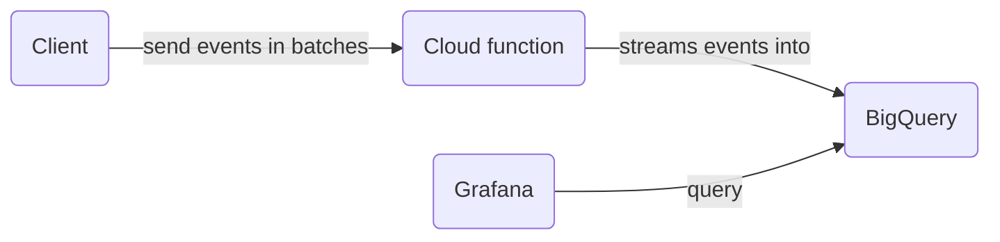

# BigQuery Generic Schemas

This package contains the schemas for custom events we send directly to BigQuery via cloud functions.



# How are we importing data into BigQuery

We're using a cloud function to send events in batches to BigQuery. The cloud function is triggered by an onCall function in the client.

## Updating Schemas

Note: You can only add new fields to a schema or relax required fields. You cannot remove fields or change their type.

1. **Update the local JSON schema file:** Let's say we want to update the [`packages/bigquery-generic-schemas/schema-views/sparkEvents.json`](./schema-views/sparkEvents.json) schema. We then add a new field or change the type of an existing field.
   ```shell
   [ ... {"name": "newField", "type": "STRING", "description": "Description for new field"}, ... ]
   ```
2. **Update the BigQuery Table:** After updating the JSON schema file, you can update the table using the bq update command. Here's how:

   ```shell
   bq update --schema ./packages/bigquery-generic-schemas/schema-views/sparkEvents.json careerfairy-e1fd9:SparkAnalytics.SparkEvents
   ```

## Adding a new schema

1. **Create a new JSON schema file:** Let's say we want to add a new schema for a new event called `newEvent`. We then create a new file called `livestreamMinutesWatched.json` in the `schema-views` folder, use the other schema files as a reference and add the new fields.
2. **Make Dataset:** Since this belong to livestreams, we need to create a new dataset called `LivestreamsAnalytics` in BigQuery.
   ```shell
   bq mk --location=EU --dataset careerfairy-e1fd9:LivestreamsAnalytics
   ```
   **_Note: If the dataset already exists, you can skip this step._**
3. **Create a new table:** We then create a new table called `LivestreamMinutesWatched` in the `LivestreamsAnalytics` dataset.
   ```shell
   bq mk --table careerfairy-e1fd9:LivestreamsAnalytics.LivestreamMinutesWatched ./packages/bigquery-generic-schemas/schema-views/livestreamMinutesWatched.json
   ```
   We can then verify that the table was created by going to BigQuery and checking the `LivestreamsAnalytics` dataset:
   

Certainly! Below is an addition to your existing README file to include a part 4 for exporting tables from BigQuery.

---

# Exporting a Table from BigQuery

After creating and populating your BigQuery tables, you might need to export the data for further analysis or to use it in another application. BigQuery supports exporting to various formats like CSV, JSON, Avro, or Parquet. Below are some methods to export a table:

### Using the BigQuery Console

1. **Navigate to BigQuery Console**: Open the BigQuery Console and navigate to your [dataset](https://console.cloud.google.com/bigquery?referrer=search&authuser=0&hl=en&project=careerfairy-e1fd9&ws=!1m5!1m4!4m3!1scareerfairy-e1fd9!2sSparkAnalytics!3sSparkEvents) (`SparkAnalytics`, for example) and select the table (`SparkEvents`, in this case) you want to export.
2. **Click on "Export"**: You'll see an "Export" button at the top. Click on it and then select your desired export method and follow the instructions:
   

### Using the `bq` Command-Line Tool

You can also use the `bq` command-line tool to export tables. Here's how to export a table to a Google Cloud Storage bucket:

#### Format

```shell
bq extract --destination_format=FORMAT 'PROJECT_ID:DATASET.TABLE' 'gs://BUCKET_NAME/FOLDER/FILE_NAME'
```

#### Example (CSV)

```shell
bq extract --destination_format=CSV 'careerfairy-e1fd9:SparkAnalytics.SparkEvents' 'gs://careerfairy-e1fd9.appspot.com/spark-events-test-export/test-spark-events.csv'
```

Replace `'gs://your-gcs-bucket/your-folder/your-file-name.csv'` with the Google Cloud Storage path where you want to save the exported table. The Google Cloud Storage path can be built from the Firebase console URL. For example, if your Firebase console [URL](https://console.firebase.google.com/u/0/project/careerfairy-e1fd9/storage/careerfairy-e1fd9.appspot.com/files) is `https://console.firebase.google.com/u/0/project/careerfairy-e1fd9/storage/careerfairy-e1fd9.appspot.com/files/~2Fspark-events-test-export`, the corresponding Google Cloud Storage path would be `gs://careerfairy-e1fd9.appspot.com/spark-events-test-export/test-spark-events.csv`.

By using one of these methods, you can easily export tables from BigQuery for use in other applications or for further analysis.
