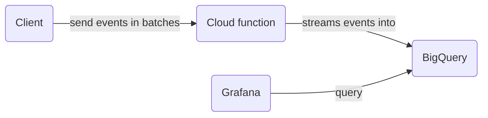

# BigQuery Generic Schemas

This package contains the schemas for custom events we send directly to BigQuery via cloud functions.



# How are we importing data into BigQuery

We're using a cloud function to send events in batches to BigQuery. The cloud function is triggered by an onCall function in the client.

## Updating Schemas

Note: You can only add new fields to a schema or relax required fields. You cannot remove fields or change their type.

1. **Update the local JSON schema file:** Let's say we want to update the [`packages/bigquery-generic-schemas/schema-views/sparkEvents.json`](./schema-views/sparkEvents.json) schema. We then add a new field or change the type of an existing field.
   ```shell
   [ ... {"name": "newField", "type": "STRING", "description": "Description for new field"}, ... ]
   ```
2. **Update the BigQuery Table:** After updating the JSON schema file, you can update the table using the bq update command. Here's how:

   ```shell
   bq update --schema ./packages/bigquery-generic-schemas/schema-views/sparkEvents.json careerfairy-e1fd9:SparkAnalytics.SparkEvents
   ```

## Adding a new schema

1. **Create a new JSON schema file:** Let's say we want to add a new schema for a new event called `newEvent`. We then create a new file called `livestreamMinutesWatched.json` in the `schema-views` folder, use the other schema files as a reference and add the new fields.
2. **Make Dataset:** Since this belong to livestreams, we need to create a new dataset called `LivestreamsAnalytics` in BigQuery.
   ```shell
   bq mk --location=EU --dataset careerfairy-e1fd9:LivestreamsAnalytics
   ```
   **_Note: If the dataset already exists, you can skip this step._**
3. **Create a new table:** We then create a new table called `LivestreamMinutesWatched` in the `LivestreamsAnalytics` dataset.
   ```shell
   bq mk --table careerfairy-e1fd9:LivestreamsAnalytics.LivestreamsAnalytics ./packages/bigquery-generic-schemas/schema-views/livestreamMinutesWatched.json
   ```
   We can then verify that the table was created by going to BigQuery and checking the `LivestreamsAnalytics` dataset:
   
