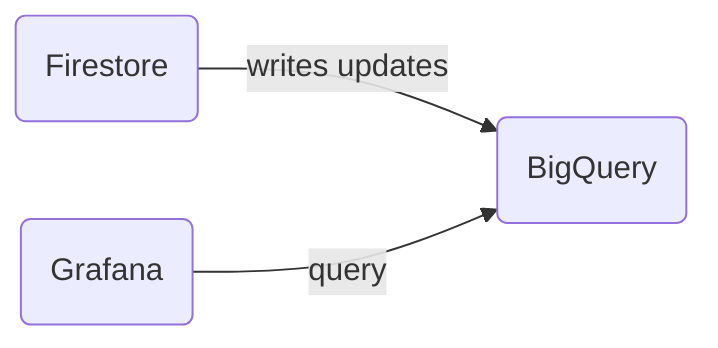

# BigQuery Imports (KPIs)

We're using Google BigQuery to perform KPIs queries.



https://careerfairy.grafana.net/

# How are we importing data into BigQuery

We're streaming updates from certain collections into BigQuery using the extension: https://firebase.google.com/products/extensions/firebase-firestore-bigquery-export
We've made an initial bulk import to backfill the existing data using the script: https://github.com/firebase/extensions/blob/master/firestore-bigquery-export/guides/IMPORT_EXISTING_DOCUMENTS.md

# Updating Schemas

Documentation: https://github.com/firebase/extensions/blob/master/firestore-bigquery-export/guides/GENERATE_SCHEMA_VIEWS.md

The `schema-views` folder contain schema files that are applied via a CLI command. These schemas are basically Views on BigQuery that map the json document from firestore into BigQuery data types.

To update a schema file (adding/changing/removing fields):

1. Update the schema file
2. Delete the two related schema views from BigQuery
   1. `careerfairy-e1fd9.firestore_export.livestreams_schema_livestreams_changelog` (example)
   2. `careerfairy-e1fd9.firestore_export.livestreams_schema_livestreams_latest` (example)
3. Deploy

```sh
# Change the table-name and file argument
npx @firebaseextensions/fs-bq-schema-views \
                  --non-interactive \
                  --project=careerfairy-e1fd9 \
                  --big-query-project=careerfairy-e1fd9 \
                  --dataset=firestore_export \
                  --table-name-prefix=livestreams \
                  --schema-files=./packages/bigquery-import/schema-views/livestreams.json
```

## Troubleshooting: Lacking Credentials

If you encounter issues related to lacking credentials when running the schema update command, follow these steps:

1. Identify the caller (authenticated user or service account) that needs permissions.

2. Grant the Required Permissions:

   -  Go to the [IAM & Admin page for the CareerFairy project](https://console.cloud.google.com/iam-admin/iam?project=careerfairy-e1fd9).
   -  Find the service account or user identified in step 1.
   -  Click on the edit (pencil) icon for that user or service account.
   -  In the "Add another role" dropdown, search for and select "Service Usage Admin". This role provides the ability to enable, disable, and inspect service states, inspect operations, and consume quota and billing for a consumer project.
   -  Save the changes.

3. Login with the following command:

```sh
gcloud auth application-default login
```

4. After completing these steps, try running the schema update command again.

# Synchronize new data into BigQuery

1. Install a new instance of the extension `Stream Collections to BigQuery` https://firebase.google.com/products/extensions/firebase-firestore-bigquery-export
2. Backfill existing data using `npx @firebaseextensions/fs-bq-import-collection` https://github.com/firebase/extensions/blob/master/firestore-bigquery-export/guides/IMPORT_EXISTING_DOCUMENTS.md
3. Create a new schema file and deploy
