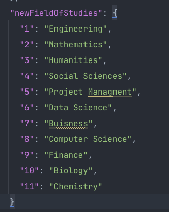

### createNewFieldsAndLevelOfStudyInFirestore

```sh
npm run script -w @careerfairy/firebase-scripts -- scriptPath=./migrations/fieldsOfStudy/createNewFieldsAndLevelOfStudyInFirestore
```

#### What it does:

This script will create/replace the `fieldOfStudy` and `levelOfStudy`collections based on the JSON file
in `packages/firebase-scripts/data/fieldAndLevelOfStudyMapping.json`([how to generate this file](../../../scripts/fieldsOfStudy/saveFieldAndLevelOfStudyMappingsToJson/README.md))
. It will look at the `newFieldOfStudies`
property in the JSON file and create/replace the collection. The key will be the document id and the value will be the
label field value in the document data.

Example:


