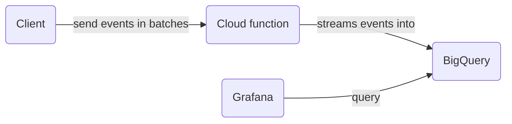

# Firebase Functions

## Secrets

There are some sensitive keys that we store in GCloud Secret Manager, those keys are injected into the functions as environment variables.

The first 6 secrets are free, after that check the pricing.

### Google Cloud Secret Manager

Current Secrets:

-  MERGE_ACCESS_KEY

#### Example commands:

```sh
# Change the value of an existing secret
npx firebase functions:secrets:set SECRET_NAME

# View the value of a secret
npx firebase functions:secrets:access SECRET_NAME

# Destroy a secret
npx functions:secrets:destroy SECRET_NAME

# View all secret versions and their state
npx functions:secrets:get SECRET_NAME

# Automatically clean up all secrets that aren't referenced by any of your functions
npx functions:secrets:prune

# Run the commands from the root folder
# More docs: https://firebase.google.com/docs/functions/config-env#managing_secrets
```

Docs: https://firebase.google.com/docs/functions/config-env#secret-manager

### Local Emulators

They will load the secrets on the file `.secrets.local`.

Docs: https://firebase.google.com/docs/functions/config-env#secrets_and_credentials_in_the_emulator

# BigQuery Schemas

This package contains the schemas for custom events we send directly to BigQuery via cloud functions.



## How are we importing data into BigQuery

We're using a cloud function to send events in batches to BigQuery. The cloud function is triggered by an onCall function in the client.

## Updating Schemas

Note: You can only add new fields to a schema or relax required fields. You cannot remove fields or change their type.

1. **Update the local JSON schema file:** Let's say we want to update the [`packages/functions/src/lib/bigQuery/schema-views/sparkEvents.json`](./schema-views/sparkEvents.json) schema. We then add a new field or change the type of an existing field.
   ```shell
   [ ... {"name": "newField", "type": "STRING", "description": "Description for new field"}, ... ]
   ```
2. **Update the BigQuery Table:** After updating the JSON schema file, you can update the table using the bq update command. Here's how:

   ```shell
   bq update --schema ./packages/functions/src/lib/bigQuery/schema-views/sparkEvents.json careerfairy-e1fd9:SparkAnalytics.SparkEvents
   ```

## Adding a New Schema

Follow these steps to add a new schema:

1. **Create a New JSON Schema File:**

   -  If you want to add a new schema for a new event, for example `newEvent`, create a new file named `livestreamMinutesWatched.json` in the `schema-views` folder.
   -  Use the other schema files as a reference and add the new fields.

2. **Create a Dataset:**

   -  If this belongs to livestreams, create a new dataset named `LivestreamsAnalytics` in BigQuery.
   -  Use the following command:

   ```shell
   bq mk --location=EU --dataset careerfairy-e1fd9:LivestreamsAnalytics
   ```

   -  **Note:** If the dataset already exists, you can skip this step.

3. **Create a New Table:**

   -  Create a new table named `LivestreamMinutesWatched` in the `LivestreamsAnalytics` dataset.
   -  Use the following command:

   ```shell
   bq mk --table careerfairy-e1fd9:LivestreamsAnalytics.LivestreamMinutesWatched ./packages/functions/src/lib/bigQuery/schema-views/livestreamMinutesWatched.json
   ```

4. **Create a Partitioned Table (Optional):**

   -  If you want to create a time-based partitioned table by day, add the `--time_partitioning_type=DAY` and `--time_partitioning_field` flags followed by the name of the column.
   -  For example, if the partitioning column in your schema is called `timestamp`, use the following command:

   ```shell
   bq mk --time_partitioning_type=DAY --time_partitioning_field=timestamp --table careerfairy-e1fd9:LivestreamsAnalytics.LivestreamMinutesWatched ./packages/functions/src/lib/bigQuery/schema-views/livestreamMinutesWatched.json
   ```

   -  This will ensure that the table is partitioned by day. You can read more about partitioned tables [here](https://cloud.google.com/bigquery/docs/partitioned-tables). When inserting data into a partitioned table, the partitioning will be handled automatically by BigQuery! So you just do normal inserts and BigQuery will take care of the rest :rocket:

5. **Querying a Partitioned Table:**

   -  You can query a partitioned table just like a normal table. Here's an example of a partitioned query:

   ```sql
   SELECT * FROM `careerfairy-e1fd9.SparkAnalytics.SparkEvents` WHERE TIMESTAMP_TRUNC(timestamp, DAY) = TIMESTAMP("2023-09-08") LIMIT 1000
   ```

   -  Normal queries also work out of the box with partitioned tables.

6. **Verify the Table Creation:**
   -  Go to BigQuery and check the `LivestreamsAnalytics` dataset to verify that the table was created.
   -  Here is an example of what you should see:
      

---

# Exporting a Table from BigQuery

After creating and populating your BigQuery tables, you might need to export the data for further analysis or to use it in another application. BigQuery supports exporting to various formats like CSV, JSON, Avro, or Parquet. Below are some methods to export a table:

### Using the BigQuery Console

1. **Navigate to BigQuery Console**: Open the BigQuery Console and navigate to your [dataset](https://console.cloud.google.com/bigquery?referrer=search&authuser=0&hl=en&project=careerfairy-e1fd9&ws=!1m5!1m4!4m3!1scareerfairy-e1fd9!2sSparkAnalytics!3sSparkEvents) (`SparkAnalytics`, for example) and select the table (`SparkEvents`, in this case) you want to export.
2. **Click on "Export"**: You'll see an "Export" button at the top. Click on it and then select your desired export method and follow the instructions:
   

### Using the `bq` Command-Line Tool

You can also use the `bq` command-line tool to export tables. Here's how to export a table to a Google Cloud Storage bucket:

#### Format

```shell
bq extract --destination_format=FORMAT 'PROJECT_ID:DATASET.TABLE' 'gs://BUCKET_NAME/FOLDER/FILE_NAME'
```

#### Example (CSV)

```shell
bq extract --destination_format=CSV 'careerfairy-e1fd9:SparkAnalytics.SparkEvents' 'gs://careerfairy-e1fd9.appspot.com/spark-events-test-export/test-spark-events.csv'
```

Replace `'gs://your-gcs-bucket/your-folder/your-file-name.csv'` with the Google Cloud Storage path where you want to save the exported table. The Google Cloud Storage path can be built from the Firebase console URL. For example, if your Firebase console [URL](https://console.firebase.google.com/u/0/project/careerfairy-e1fd9/storage/careerfairy-e1fd9.appspot.com/files) is `https://console.firebase.google.com/u/0/project/careerfairy-e1fd9/storage/careerfairy-e1fd9.appspot.com/files/~2Fspark-events-test-export`, the corresponding Google Cloud Storage path would be `gs://careerfairy-e1fd9.appspot.com/spark-events-test-export/test-spark-events.csv`.

By using one of these methods, you can easily export tables from BigQuery for use in other applications or for further analysis.
